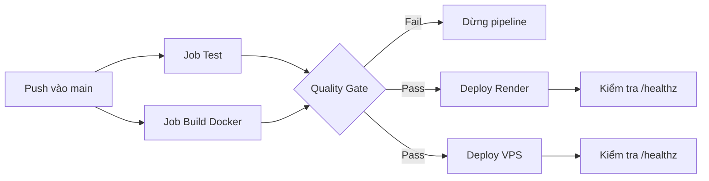
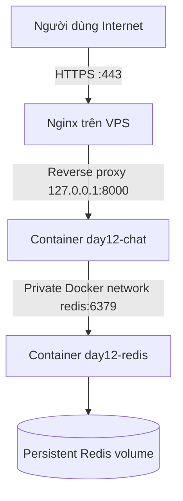
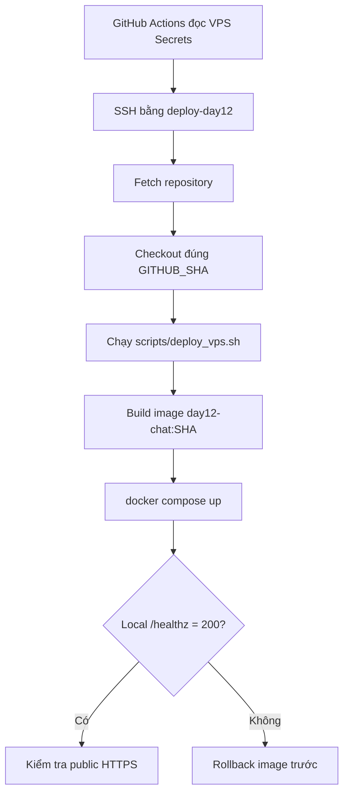

# Triển khai Production trên Render và VPS

Tài liệu này mô tả hai môi trường production của dự án **K4 Day 12 — Cloud Services & Deployment**. Cả hai môi trường chạy cùng một ứng dụng FastAPI, dùng Redis để lưu trạng thái và được cập nhật tự động bằng GitHub Actions khi code mới được push lên nhánh `main`.

## Đường dẫn truy cập

| Môi trường | Public URL | Đặc điểm |
|---|---|---|
| Render | [https://k4-day12-2a202601424-nguyenquangha.onrender.com](https://k4-day12-2a202601424-nguyenquangha.onrender.com) | Nền tảng cloud được quản lý |
| Contabo VPS | [https://miraculum.duckdns.org](https://miraculum.duckdns.org) | Máy chủ tự quản lý bằng Docker, Nginx và UFW |
| GitHub Actions | [Xem lịch sử CI/CD](https://github.com/quangha-dev/K4-DAY12-2A202601424-NguyenQuangHa/actions) | Test, build và deploy tự động |

Các endpoint chính có trên cả hai môi trường:

| Endpoint | Mục đích | Kết quả mong đợi |
|---|---|---|
| `GET /` | Production Dashboard | HTTP `200` |
| `GET /healthz` | Liveness của process | HTTP `200` |
| `GET /readyz` | Readiness của ứng dụng và Redis | HTTP `200` |
| `POST /chat` không có Bearer token | Kiểm tra xác thực | HTTP `401` |
| `POST /chat` có Bearer token hợp lệ | Gọi mock LLM | HTTP `200` |

## Luồng CI/CD dùng chung



- Pull Request chỉ chạy `Test` và `Build Docker`, không thay đổi production.
- Hai job deploy khai báo `needs: [test, build]`, vì vậy không chạy nếu một job CI thất bại.
- Render và VPS là hai nhánh CD độc lập. Một nhánh gặp sự cố không thay đổi cấu hình của nhánh còn lại.
- Credential deploy được lưu bằng GitHub Actions Secrets, không được ghi trực tiếp trong workflow hoặc source code.

## Môi trường Render

Render là môi trường **managed cloud**. Nền tảng chịu trách nhiệm quản lý máy chủ, Docker runtime, domain HTTPS, restart service và giao diện log.

Luồng triển khai:

1. Job `Deploy to Render` gọi Render Deploy Hook.
2. Render lấy source mới nhất từ repository GitHub.
3. Render build image theo `Dockerfile` multi-stage.
4. Các biến `API_TOKEN`, `REDIS_URL` và `PORT` được inject từ Environment của Render.
5. Service khởi động bằng Uvicorn và được kiểm tra qua `/healthz`.

Lưu ý khi sử dụng Render:

- Không ghi secret vào `render.yaml` hoặc repository.
- `REDIS_URL` phải trỏ đến Redis/Key Value service thật trên cloud.
- Ứng dụng phải đọc biến `$PORT`, không cố định cổng `8000`.
- Free instance có thể sleep khi không có traffic, nên request đầu tiên có thể chậm.
- Deploy Hook chạy bất đồng bộ; HTTP `200` ngay sau khi gọi hook có thể vẫn đến từ phiên bản cũ. Cần kiểm tra dashboard Render hoặc nội dung phiên bản sau khi build hoàn tất.

## Môi trường Contabo VPS

VPS là môi trường **self-managed**. Nhóm tự quản lý hệ điều hành, tài khoản SSH, Docker, reverse proxy, HTTPS, firewall, volume dữ liệu, log và quy trình rollback.

### Kiến trúc request



- Nginx là thành phần duy nhất nhận traffic web public.
- FastAPI chỉ bind vào `127.0.0.1:8000`, không public trực tiếp cổng ứng dụng.
- Redis không map cổng `6379` ra VPS và chỉ giao tiếp với API qua Docker network.
- Nginx terminate TLS rồi chuyển request vào container API.
- Redis dùng named volume để dữ liệu không mất khi container được recreate.

### Luồng triển khai VPS



Mã nguồn được clone tại:

```text
/opt/k4-day12
```

Secret runtime được đặt ngoài repository:

```text
/opt/k4-day12-secrets/app.env
```

File secret chỉ cho deploy user đọc, không được commit hoặc in ra log. Các GitHub Secrets cần cho job VPS gồm:

- `VPS_HOST`
- `VPS_USER`
- `VPS_SSH_PRIVATE_KEY`
- `VPS_SSH_KNOWN_HOSTS`

Repository Variable dùng để kiểm tra public endpoint:

- `VPS_PUBLIC_URL=https://miraculum.duckdns.org`

### Cấu hình bảo mật VPS

| Lớp | Cấu hình |
|---|---|
| SSH | Deploy bằng user `deploy-day12` và SSH key riêng; không ghi mật khẩu trong workflow |
| Runtime secret | File environment nằm ngoài repository, quyền truy cập hạn chế |
| API container | Chạy non-root, read-only filesystem, `cap_drop: ALL`, `no-new-privileges` |
| Network | API chỉ bind localhost; Redis không có public port |
| Reverse proxy | Nginx nhận HTTP/HTTPS và chuyển traffic đến API nội bộ |
| Firewall | UFW chỉ mở các cổng cần thiết: `22`, `80`, `443` |
| Persistence | Redis sử dụng Docker named volume |
| Recovery | Image được tag theo commit SHA và deploy script hỗ trợ rollback |
| Log | Docker log rotation tránh log chiếm toàn bộ dung lượng đĩa |

### Lệnh kiểm tra trên VPS

Chạy trong thư mục `/opt/k4-day12`:

```bash
# Trạng thái container
docker compose -f docker-compose.vps.yml ps

# Xem log API và Redis
docker compose -f docker-compose.vps.yml logs --tail=100 chat redis

# Kiểm tra API nội bộ sau Nginx
curl -i http://127.0.0.1:8000/healthz
curl -i http://127.0.0.1:8000/readyz

# Kiểm tra public HTTPS
curl -i https://miraculum.duckdns.org/healthz
curl -i https://miraculum.duckdns.org/readyz
```

Không dùng lệnh hiển thị toàn bộ biến môi trường của container vì có thể làm lộ `API_TOKEN` trong terminal hoặc log.

### Checklist vận hành VPS

- DNS A record phải trỏ đúng VPS trước khi cấu hình chứng chỉ HTTPS.
- Private SSH key chỉ nằm trong GitHub Secrets; VPS chỉ lưu public key.
- Không public Redis `6379` hoặc API `8000` ra Internet.
- Sau mỗi deploy, kiểm tra container, log, `/healthz` và `/readyz`.
- Sao lưu Redis volume và cấu hình Nginx trước khi nâng cấp lớn.
- Theo dõi CPU, RAM, dung lượng đĩa, Docker logs và ngày hết hạn certificate.
- Xoay API token và SSH key ngay khi nghi ngờ bị lộ.
- Giữ image trước đó cho đến khi phiên bản mới đã vượt qua health check.

## So sánh hai môi trường

| Tiêu chí | Render | VPS |
|---|---|---|
| Thiết lập ban đầu | Nhanh, giao diện trực quan | Nhiều bước cấu hình hệ thống |
| Quản lý server | Render quản lý | Nhóm tự quản lý |
| Docker | Render build và chạy | Docker Compose trên VPS |
| HTTPS | Tự động | Nginx và certificate do nhóm quản lý |
| Firewall | Nền tảng quản lý | UFW do nhóm cấu hình |
| Redis | Cloud service/reference | Container riêng với persistent volume |
| Deploy | Deploy Hook | SSH và `deploy_vps.sh` |
| Rollback | Thao tác trên Render dashboard | Quay lại image được tag theo commit SHA |
| Phù hợp | Lab, demo, deploy nhanh | Học hạ tầng chi tiết và toàn quyền vận hành |

## Kiểm tra nhanh từ máy cá nhân

```powershell
$render = "https://k4-day12-2a202601424-nguyenquangha.onrender.com"
$vps = "https://miraculum.duckdns.org"

Invoke-WebRequest "$render/healthz" -UseBasicParsing
Invoke-WebRequest "$render/readyz" -UseBasicParsing
Invoke-WebRequest "$vps/healthz" -UseBasicParsing
Invoke-WebRequest "$vps/readyz" -UseBasicParsing
```

Kết quả mong đợi cho cả hai môi trường là `/healthz` và `/readyz` đều trả HTTP `200`.
